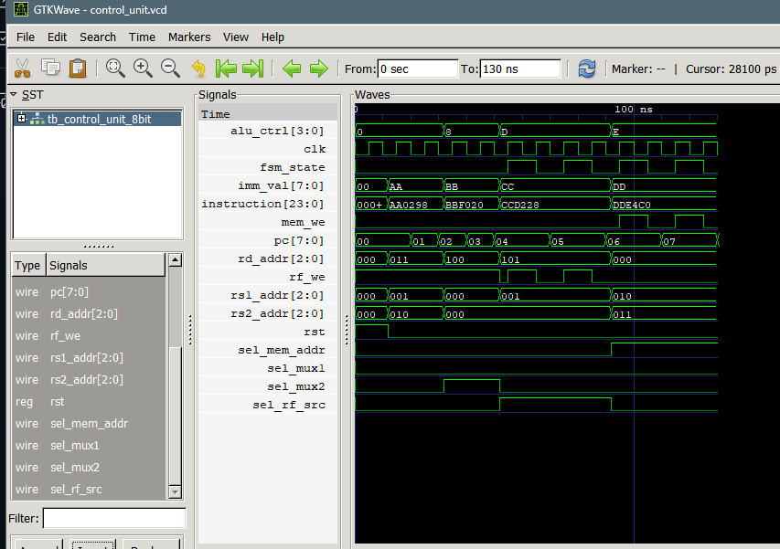

SUBMITTED BY: Pratik Khatiwada
THA070BEI025

SUBMITTED TO: Krishna Gaire sir
FPGA

---------------------lab2----------------------
This lab implements a simple control unit in Verilog. The design decodes a 16‑bit instruction into register addresses, ALU operation codes, immediate values, and control signals. It maintains a program counter that increments each cycle and generates appropriate control signals based on the opcode. The control unit supports arithmetic, logical, comparison, and immediate load operations. The design is verified using a testbench that applies a sequence of instructions and monitors the outputs (alu_op, writeenable, readreg1, readreg2, writereg, pc, etc.) to ensure correct decoding and signal generation.

Output:
