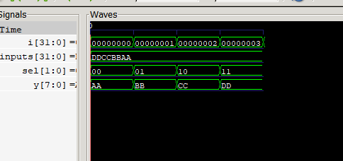

SUBMITTED BY:Pratik Khatiwada
THA070BEI025

SUBMITTED TO: Krishna Gaire sir
FPGA 

---------------------lab1----------------------
This lab implements a parameterized N-to-1 multiplexer in Verilog. The design selects one of N input buses and forwards it to the output based on a binary encoded select signal. Each input is W-bits wide and all N inputs are packed into a single flat bus. The select line is log₂N bits wide, allowing 2^SEL unique input selections. The design is verified using a testbench that cycles through all N select values and checks the output against the expected input lane.

Output:
## Simulation Waveform

