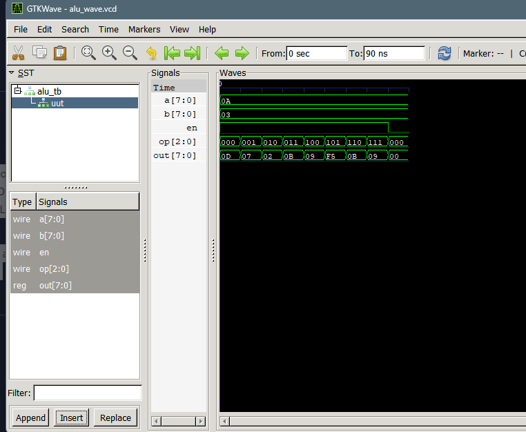

SUBMITTED BY: Pratik Khatiwada
THA070BEI025

SUBMITTED TO: Krishna Gaire Sir
FPGA

Lab 2: 8‑bit ALU Implementation
This lab implements an 8‑bit Arithmetic Logic Unit (ALU) in Verilog. The ALU performs a set of arithmetic and logical operations based on a 3‑bit operation code (op). Supported operations include addition, subtraction, bitwise AND, OR, XOR, NOT, increment, and decrement. An enable signal (en) controls whether the ALU produces a valid output or resets to zero.

The design is verified using a testbench that applies different values of a, b, and cycles through all operation codes while monitoring the output. The simulation confirms correct functionality for each operation.

OUTPUT:
